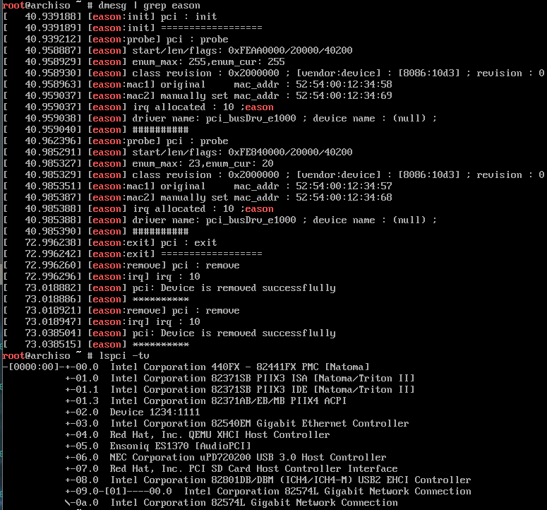

# (1/3) 模拟x86设备运行pcie设备驱动，读取英特尔的82540EM和82574L千兆以太网卡信息
**模拟x86设备，添加82540EM和82574L千兆以太网卡，以测试pcie总线驱动。** 
- (01)对82540EM千兆以太网卡：读取类/供应商/设备ID，从EEPROM读取默认MAC地址。 
- (02)对82574L千兆以太网卡：读取类/供应商/设备ID，读取MAC，并通过写寄存器方式更改MAC地址；

# (2/3) 模拟 ARM Cortex-M3 芯片
## (01) 查询支持的设备列表（仅保留eason_m3设备/开发板）：
> `[eason@Arch]$ ./qemu-system-arm -M help`
&#8195;Supported machines are: 
&#8195;eason_m3             eason's machine ( cortex-m3 , tested) 
&#8195;none                 empty machine 
## (02) 启动qemu-system-arm仿真eason_m3设备，运行demo程序（startup.bin）
- 备注：目前仅参考PCIE设备linux驱动的数据结构，从程序架构上优化了芯片SOC数据结构。
> `[eason@Arch]$ ./qemu-system-arm -M eason_m3 -kernel startup.bin -nographic` 
&#8195;[01] Entry from main! 
&#8195;[ISR] Execute in ISR to respond to interrupt from [source: demo] ! 
&#8195;QEMU: Terminated (按下快捷键退出QEMU) 
